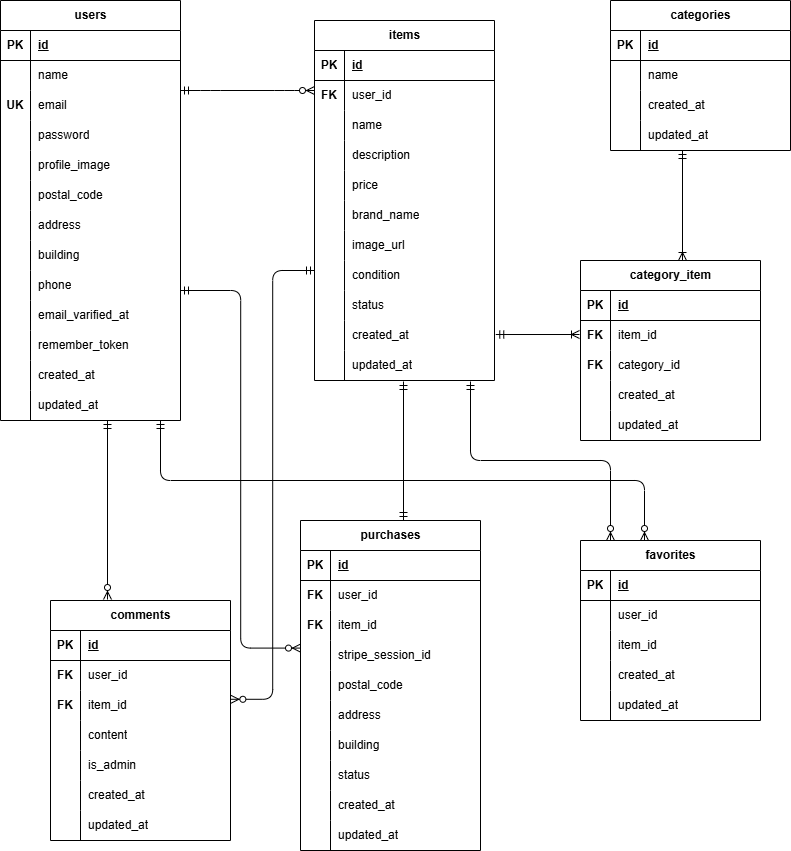

# coachtechフリマ(フリマアプリ)

## 環境構築

### Dockerビルド
 1 git clone git@github.com:norinori25/fleamarket-test.git
 2 DockerDesktopアプリを立ち上げる
 3 docker-compose up -d --build

### Laravel環境構築
 1 docker-compose exec php bash
 2 composer install
 3 cp .env.example .env
 4 .env（例）

    APP_NAME=Laravel
    APP_ENV=local
    APP_KEY=base64:xxxxxxxxxxxxxxxxxxxxxxxxxxxxxx
    APP_DEBUG=true
    APP_URL=https://example.ngrok-free.dev

    LOG_CHANNEL=stack
    LOG_LEVEL=debug

    DB_CONNECTION=mysql
    DB_HOST=mysql
    DB_PORT=3306
    DB_DATABASE=laravel_db
    DB_USERNAME=laravel_user
    DB_PASSWORD=laravel_pass

    MAIL_MAILER=smtp
    MAIL_HOST=mailhog
    MAIL_PORT=1025
    MAIL_FROM_ADDRESS="<noreply@example.com>"
    MAIL_FROM_NAME="FleaMarket App"

    STRIPE_KEY=pk_test_****************************
    STRIPE_SECRET=sk_test_****************************
    STRIPE_WEBHOOK_SECRET=whsec_****************************

 5 アプリケーションキー作成
   php artisan key:generate
 6 マイグレーションの実行
   php artisan migrate
 7 シーディングの実行
   php artisan db:seed

## テスト実行
 1 docker-compose exec php bash
 2 php artisan test

## 使用技術(実行環境)
 ・言語  PHP 8.1.33
 ・フレームワーク  Laravel 8.83.8
 ・データベース  MySQL 8.0.26
 ・Webサーバー  Nginx 1.21.1
 ・パッケージ管理  Composer
 ・メール確認ツール  MailHog
 ・決済サービス  Stripe（テスト環境）
 ・コンテナ管理  Docker / docker-compose

## ER図
  

## URL
 ・開発環境： http://localhost/
 ・phpMyAdmin: http://localhost:8080/
 ・MailHog: http://localhost:8025